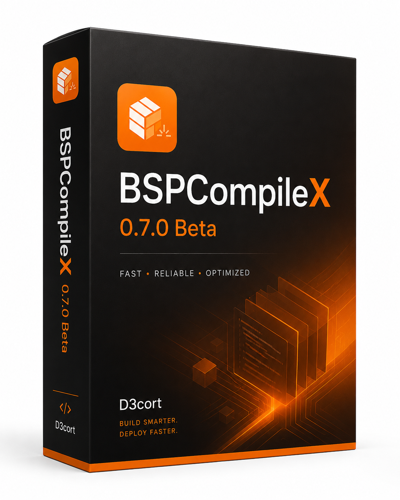

# BSPCompileX

  

  
  
  
  

**BSPCompileX** is a native Windows toolkit for Garry's Mod map compilation, BSP decompilation, model conversion and Source texture creation.

## Download

- **[Download BSPCompileX 0.7.8 Beta for Windows x64](https://github.com/D3cort/BSPCompileX/releases/download/v0.7.8-beta/BSPCompileX-0.7.8-Beta-Windows-x64.exe)**
- [Open the latest GitHub release](https://github.com/D3cort/BSPCompileX/releases/tag/v0.7.8-beta)
- [Download the SHA-256 checksum](https://github.com/D3cort/BSPCompileX/releases/download/v0.7.8-beta/BSPCompileX-0.7.8-Beta-Windows-x64.sha256.txt)

## Features

- Separate **Compiler**, **Decompiler**, **Models** and **Textures** workspaces.
- WebView2-based primary interface backed by the native C++ core.
- Built-in VMF/BSP, model and material viewports.
- Large-map Titan Geometry compilation and FullHDR lighting.
- Direct model conversion with LODs, collision and animations.
- Static and animated VTF/VMT conversion with material and normal-map tools.
- Automatic content packaging and Garry's Mod path detection.

## Requirements

- Windows 10 or Windows 11 on x64.
- Garry's Mod and its x64 Source tools for map compilation.
- Microsoft Edge WebView2 Runtime.
- A final in-game check before publishing important maps or assets; this remains a Beta release.

## License

Official unmodified binaries may be used free of charge in personal, open-source, freeware and commercial projects. No royalty, payment or attribution is required. Reverse engineering, modification, redistribution for a separate fee, and use of leaked or recovered code are prohibited except where mandatory law provides otherwise. Read the complete [BSPCompileX license](LICENSE.txt) before use.

Developer: **[D3cort](https://github.com/D3cort)**
